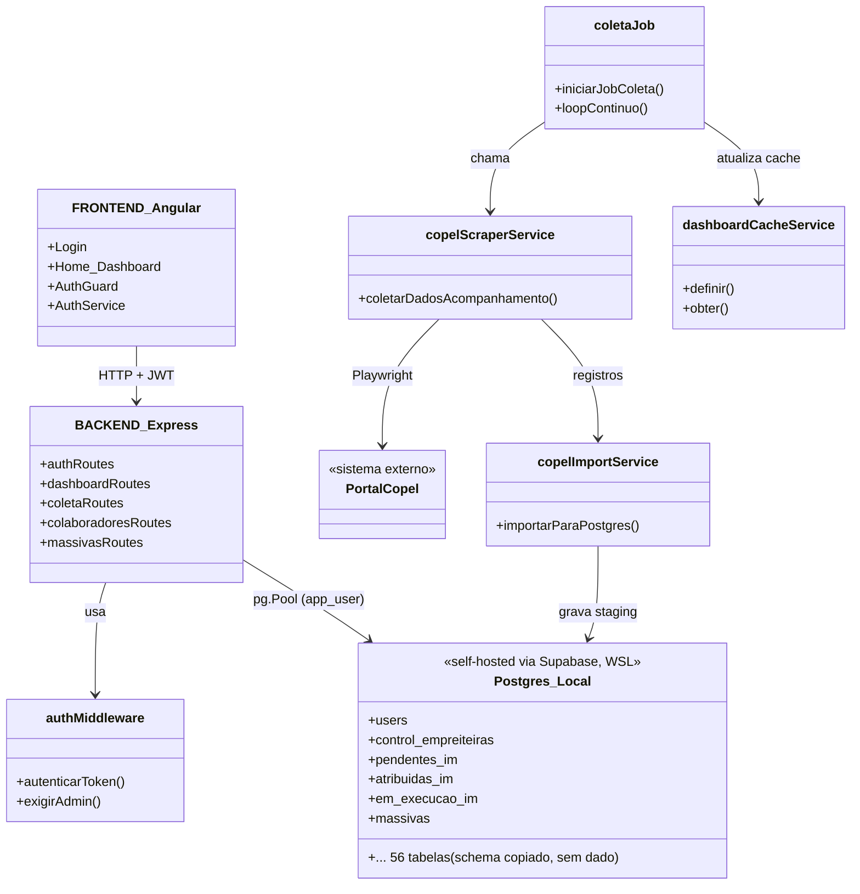
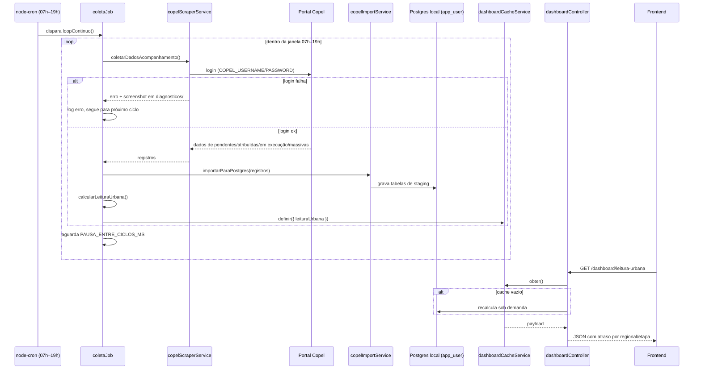

# Arquitetura — Olho de Deus

## Visão geral

Monorepo com dois apps independentes (sem workspace compartilhado). Em desenvolvimento, o
Postgres é **local** — self-hosted via Supabase (WSL2 + Docker) — e o backend acessa direto
via `pg` (node-postgres), sem ORM. O Supabase self-hosted (Studio, Auth, PostgREST etc.) só
existe como ferramenta de gestão/visualização do banco; o app não passa por ele. Ver
[ADR 0002](adr/0002-postgres-local-via-supabase-sem-prisma.md).

## Fluxo crítico — coleta automática e atualização do painel

Se este fluxo quebra, o dashboard fica com dado velho e a coordenação volta a descobrir
atraso tarde — é o problema que o sistema existe para resolver.

## Decisões registradas

- [ADR 0001](adr/0001-perfil-e-caminho-dados.md) — perfil `app-single-tenant`.
- [ADR 0002](adr/0002-postgres-local-via-supabase-sem-prisma.md) — Postgres local
  self-hosted via Supabase, acesso direto por `pg`, sem Prisma.
