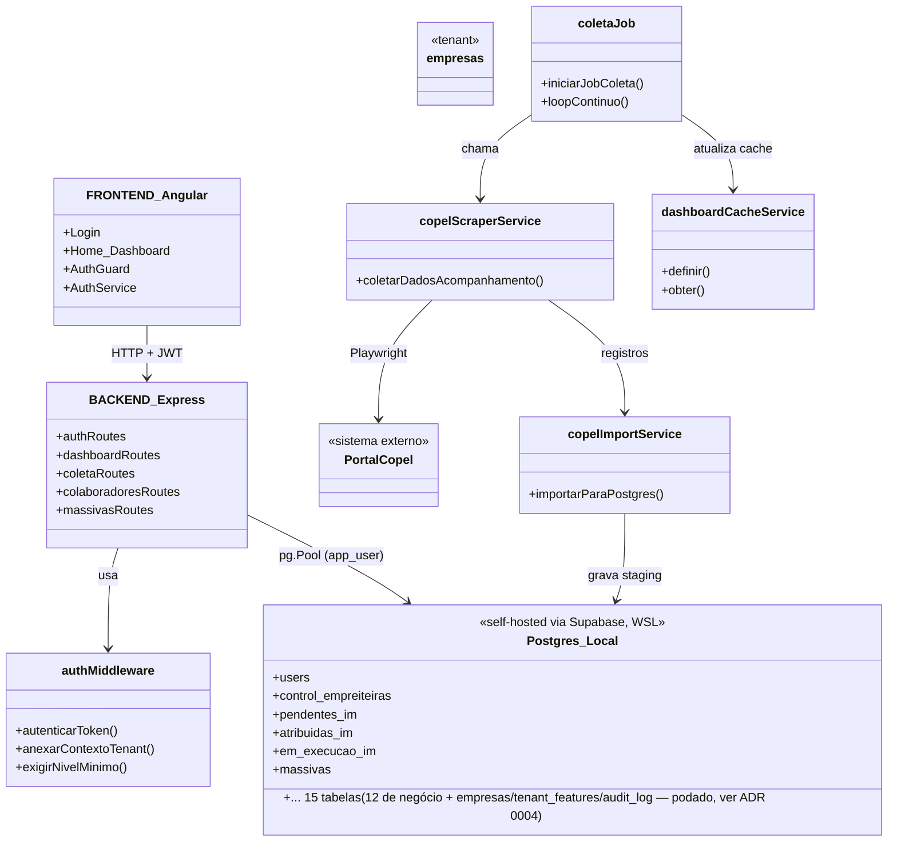
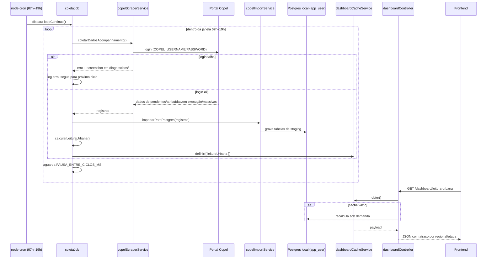

# Arquitetura — Olho de Deus

## Visão geral

Monorepo com dois apps independentes (sem workspace compartilhado). Em desenvolvimento, o
Postgres é **local** — self-hosted via Supabase (WSL2 + Docker) — e o backend acessa direto
via `pg` (node-postgres), sem ORM. O Supabase self-hosted (Studio, Auth, PostgREST etc.) só
existe como ferramenta de gestão/visualização do banco; o app não passa por ele. Ver
[ADR 0002](adr/0002-postgres-local-via-supabase-sem-prisma.md).

SaaS multi-cliente: cada empresa isolada por `empresa_id` + RLS, papel `ROOT` (Codexa) por
cima de todas. Toda rota de negócio abre um contexto de tenant (`req.db`) a partir do JWT
antes de tocar o banco. Ver [ADR 0003](adr/0003-rbac-multi-tenant.md) e
[`docs/RBAC.md`](RBAC.md).

## Fluxo crítico — coleta automática e atualização do painel

Se este fluxo quebra, o dashboard fica com dado velho e a coordenação volta a descobrir
atraso tarde — é o problema que o sistema existe para resolver.

## Decisões registradas

- [ADR 0001](adr/0001-perfil-e-caminho-dados.md) — perfil original `app-single-tenant`
  (superado pela ADR 0003).
- [ADR 0002](adr/0002-postgres-local-via-supabase-sem-prisma.md) — Postgres local
  self-hosted via Supabase, acesso direto por `pg`, sem Prisma.
- [ADR 0003](adr/0003-rbac-multi-tenant.md) — reclassificação para `saas-multi-cliente`,
  RBAC de 4 níveis (`ROOT`/`ADMINISTRADOR`/`SUPERVISOR`/`USUARIO`), `empresa_id` + RLS.
- [ADR 0004](adr/0004-poda-de-tabelas-nao-usadas.md) — banco local reduzido de 56 pra 15
  tabelas (só o que o app usa de fato).
- [ADR 0005](adr/0005-importacao-de-planilha.md) — importação de planilha (.xlsx) por
  tabela, `ADMINISTRADOR`/`ROOT`.
- [ADR 0006](adr/0006-filtro-tipo-servico-leitura-releitura.md) — filtro leitura/releitura
  (via `contr_execucao_leitura`) somado à massiva em Monitoramento de Livros.
- [ADR 0007](adr/0007-restaura-tab-ligacao-coordenadas.md) — `tab_ligacao_coordenadas`
  restaurada (referência compartilhada, sem `empresa_id`) e habilitada pra importação por
  UC.
- [ADR 0008](adr/0008-empresa-alvo-importacao-root.md) — `ROOT` escolhe a empresa alvo do
  import (`?empresaId=`) já que não tem uma própria; `GET /empresas` novo pra alimentar o
  seletor.
- [ADR 0009](adr/0009-empresa_id-nas-tabelas-de-referencia.md) — `calendario_leitura`,
  `cidades_localidades` e `tab_ligacao_coordenadas` deixaram de ser referência
  compartilhada e ganharam `empresa_id` + RLS — cada empresa pode ter contrato/região
  diferente. Não existe mais tabela de negócio sem dono.
