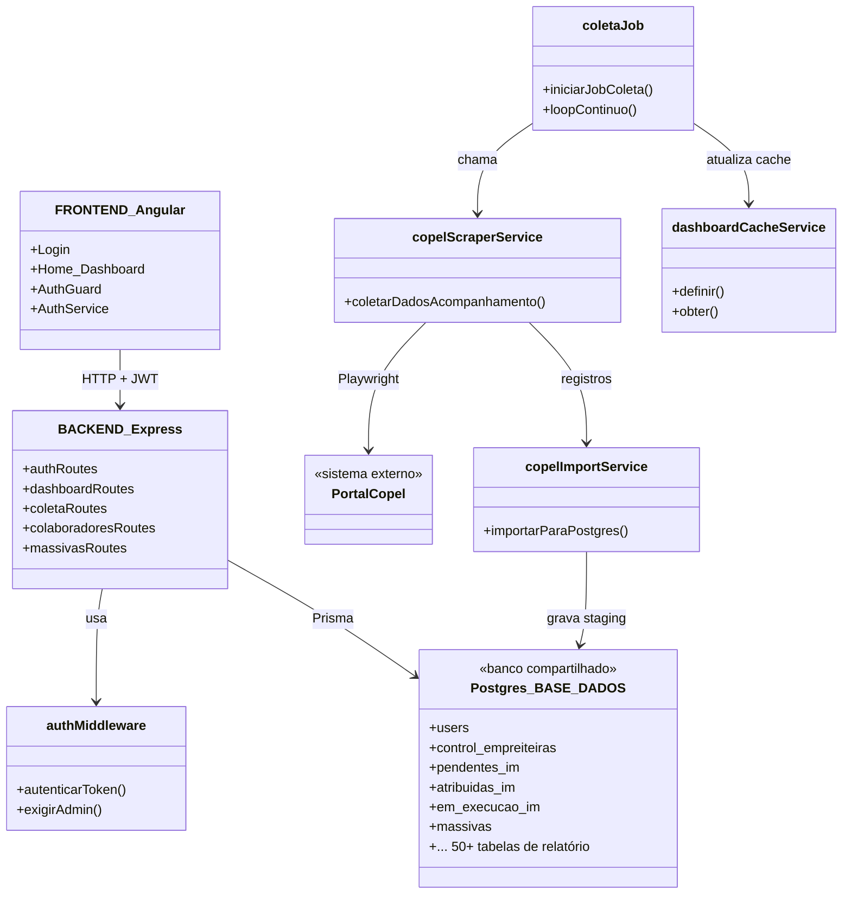
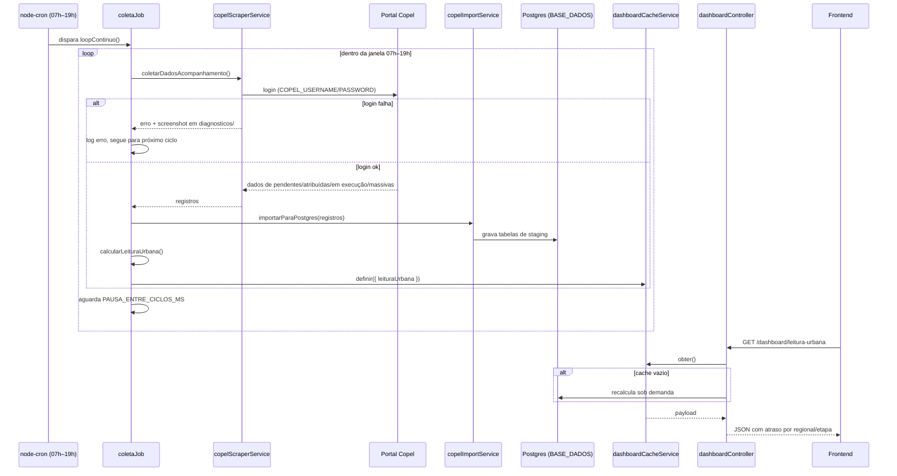

# Arquitetura — Olho de Deus

## Visão geral

Monorepo com dois apps independentes (sem workspace compartilhado) e um Postgres externo
que também serve como data warehouse de relatórios da operação.

## Fluxo crítico — coleta automática e atualização do painel

Se este fluxo quebra, o dashboard fica com dado velho e a coordenação volta a descobrir
atraso tarde — é o problema que o sistema existe para resolver.

## Decisões registradas

Ver [`docs/adr/0001-perfil-e-caminho-dados.md`](adr/0001-perfil-e-caminho-dados.md) para a
justificativa do perfil `app-single-tenant` e do caminho de dados Prisma em modo
introspecção (sem migration).
